# Phase 0 — setup, before session 1

About 10 minutes, in a browser. **Do it at home.** Session 1 is hands-on from
the first minute and there is no time to set anything up in the room.

At the end you run one command and paste one line into an issue on this
repository. That line tells the instructor whether you're ready, three days
early, while there is still time to fix things.

Everything here is free. No credit card is required at any point.

---

## Open your Codespace

The workshop runs in a Codespace: a container on GitHub's machines, with a real
terminal, a real editor and this repository already in it. Everything slow is
already done — `uv`, `cloudflared`, the dependencies, the 42 documents, the
60,000 sightings and the 80 MB embedding model are all baked into the image.

That is what makes this ten minutes rather than half an hour, and it is why
nothing below depends on which machine or operating system you have. You need a
browser and a GitHub account, and you install nothing.

1. Sign in to [github.com](https://github.com) — a free personal account is
   enough. Create one if you don't have one.
2. On this repository, click the green **Code** button → **Codespaces** →
   **Create codespace on main**.

   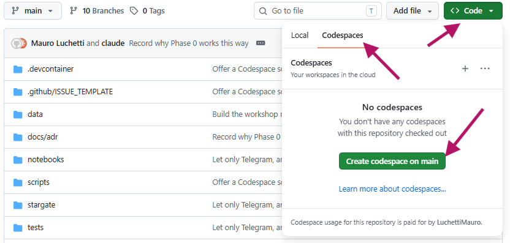

3. Wait. The first one takes a couple of minutes; after that, reopening it is
   seconds.
4. When the editor appears, open a terminal. Click the **☰** button at the
   top left, then **View → Terminal**. A panel opens along the bottom of the
   window: that panel is the terminal, and it is where every command in this
   workshop gets typed.

   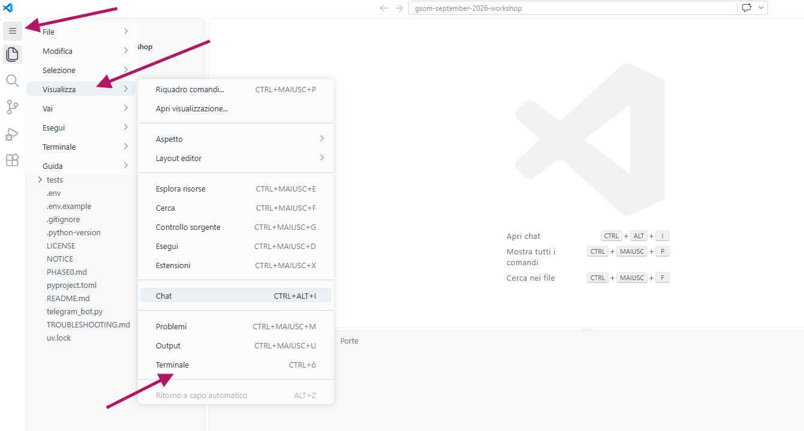

   The editor speaks whatever language your browser does, so your menu may
   read *Visualizza → Terminale*, as in the screenshot above. There is a
   keyboard shortcut too — the menu shows it next to the word Terminal — but
   it lands on a different key depending on your keyboard, so the menu is the
   reliable way in.

5. Give yourself your own copy of the workshop files to work in. Copy the line
   below, click once inside the terminal panel, paste it, and press Enter:

   ```bash
   git switch -c mywork origin/main
   ```

   Hover over the box and a **copy** icon appears in its top right corner —
   that is the safest way to copy, because a single wrong character makes the
   command fail. To paste into the terminal: `Ctrl+V` on Windows and Linux,
   `Cmd+V` on a Mac.

   Once pasted, it looks like this: the command sits at the end of the last
   line, waiting for you to press Enter.

   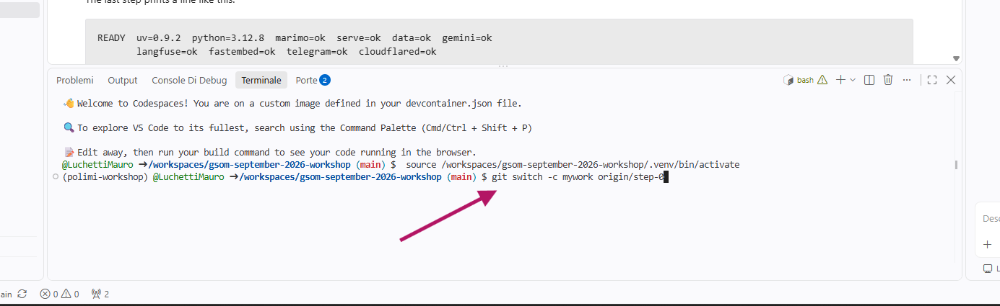

   If nothing seems to happen after Enter, look for a line mentioning
   `mywork`; that means it worked.

   Every one of these boxes works the same way for the rest of the workshop:
   copy, paste into the terminal, press Enter.

**Why that branch.** `git switch -c mywork origin/main` puts you on your own
branch from the start, holding the whole repository: every module the nine
notebooks use is there from day one, so no notebook ever asks you to switch
branches mid-lesson.

Stay on it. The `step-*` branches still exist, as checkpoints to fall back on
if you break something, and they are regenerated and force-pushed between
sessions — so anything you commit directly onto one is overwritten without
warning.

**Two things about that terminal.**

*Every command in this workshop goes into one*, and a terminal in a Codespace
opens at the repository root — the folder holding `pyproject.toml` — which is
where all of them assume you are. Nothing to `cd` to, nothing to activate.

*You will need two more of them in session 2*, running alongside the one marimo
occupies: one for the bot, one for the tunnel. Notebook 07 walks through
opening them.

> **Do not type these into a Python REPL or a Jupyter cell.** Commands starting
> with `uv`, `git`, `cd` or `curl` go to the shell. If you see
> `SyntaxError: invalid syntax` on a line starting with `uv`, you typed a shell
> command into Python.

**Four things to know about a Codespace.**

*Stopping it.* It stops itself after 30 minutes of inactivity, and you can stop
it yourself from [github.com/codespaces](https://github.com/codespaces).
GitHub gives every personal account a free monthly allowance and this workshop
uses a small part of it, but the meter runs while the container is awake, not
while it is working. Stop it when you're done for the day.

*It remembers.* Stopping is not deleting: your files, your branch, your `.env`
and the downloaded model are all still there when you start it again. This is
the whole reason we are not using a notebook service that resets. What does not
survive is anything that was *running*: after a restart you open a terminal and
start marimo again, which is one command and no setup —
[*Picking it up again after a break*](README.md#picking-it-up-again-after-a-break)
in README.md has it.

*It expires.* A Codespace nobody opens for 30 days is deleted. If more than a
month passes between the two sessions, expect to create a fresh one — which is
fine, it just means doing Phase 0's key-pasting again.

*Keep your ports private.* VS Code will offer to forward ports and mark them
public. Don't. marimo runs arbitrary Python, so a public marimo port is a
public shell on your container. Session 2 gives the agent a public address a
different way, through a tunnel, and that one is deliberate.

---

The screenshots below are in Italian: both sites follow the language of your
account, so your buttons may read differently, but they sit in the same places.

## 1. Get a Google AI Studio key

This is the key that lets your code talk to Gemini. Free, and no credit card.
It is the only key you actually need.

1. Go to https://aistudio.google.com/apikey and sign in with any Google
   account. You land on the **API keys** page, empty the first time. Click
   **Create API key**, top right.

   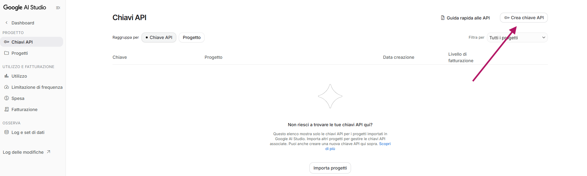

2. A box asks for a name and a project. The first time there is no project to
   choose from, so open the dropdown and pick **Create project**.

   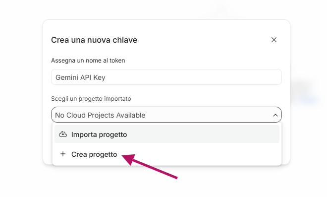

3. Name the project — `polimi-workshop` does fine — and confirm.

   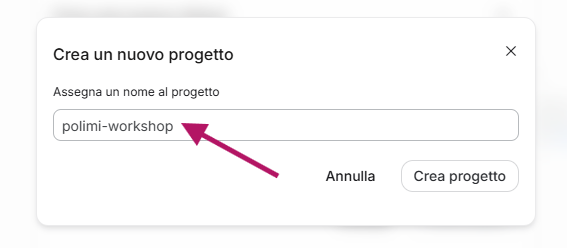

4. You are back at the first box, your new project now selected. Click
   **Create key**.

   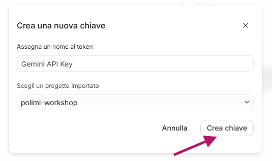

5. The key appears. Click the copy icon beside it, and paste it straight away
   somewhere you can find in a minute: an empty note, or the `.env` file from
   [step 4](#4-fill-in-your-keys) if you already have it open.

   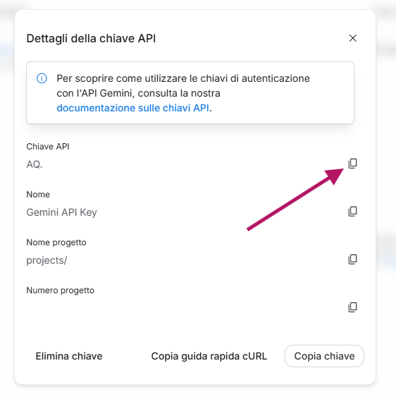

> If you're in the EU, your prompts on the free tier get the same data
> protections as the paid tier. Google's terms make that explicit for the EEA,
> Switzerland and the UK.

## 2. Get a Langfuse account

This is where every agent run gets recorded. You'll spend half of session 2
looking at your own traces here.

1. Go to https://cloud.langfuse.com and sign up. **Choose the EU region** when
   asked: the EU one is the plain `cloud.langfuse.com` address, and that is
   the address `.env` already expects.

2. The first screen offers to create an organisation. Click
   **New Organization**.

   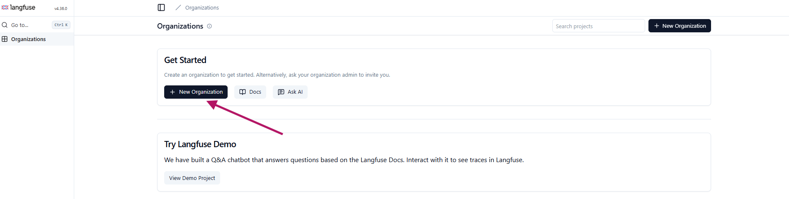

3. Give it a name — anything at all — and click **Create**. The *Enable AI
   powered features* switch makes no difference to this workshop; leave it
   however you find it.

   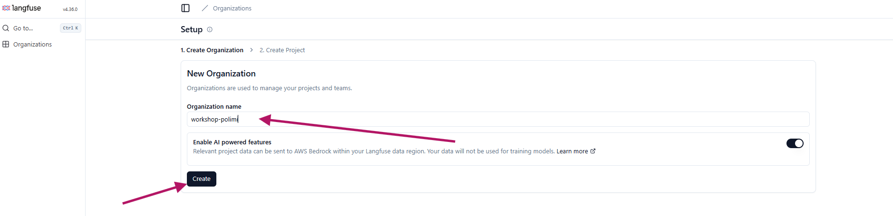

4. Langfuse then asks for a project. Name it and click **Create** again.

   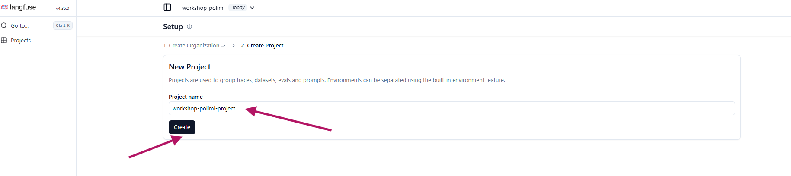

5. The project opens on *Time to log your first trace*. Click
   **Create new API key**.

   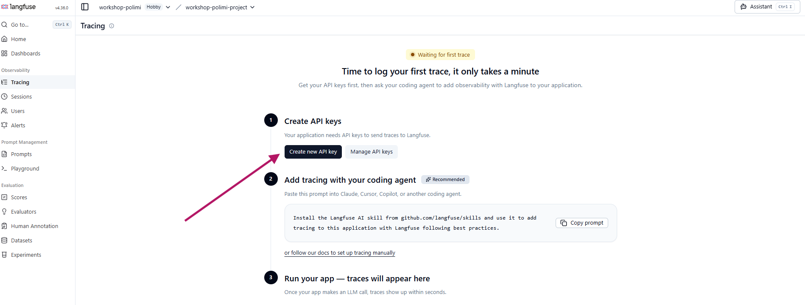

6. Two keys appear: a secret key starting `sk-lf-` and a public key starting
   `pk-lf-`. Copy both with the icons on the right.

   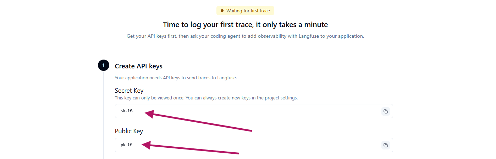

   **The secret key is shown once and never again.** If you close this panel
   without copying it, nothing is broken — you just come back and create a
   second pair, and use those instead.

## 3. Get a Telegram bot token

Used in session 2. Takes about a minute, and the token never expires. Do it on
the phone or on Telegram Desktop, whichever you already use.

1. In Telegram, start a new chat: the pencil icon at the top right of your
   chat list.

   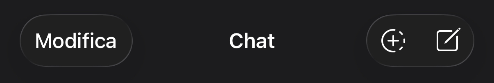

2. Search for `@BotFather` and open the result with the blue tick. There are
   copycats with similar names; the verified one is the real one.

   

   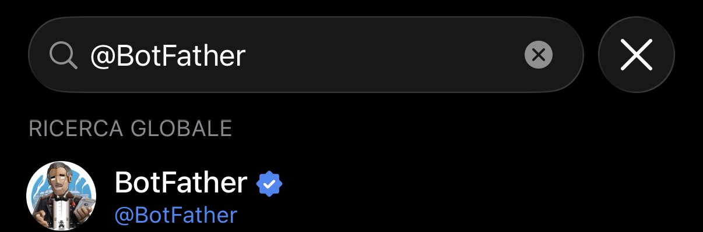

3. Open the chat and press **Start** — *Avvia*, in the screenshot.

   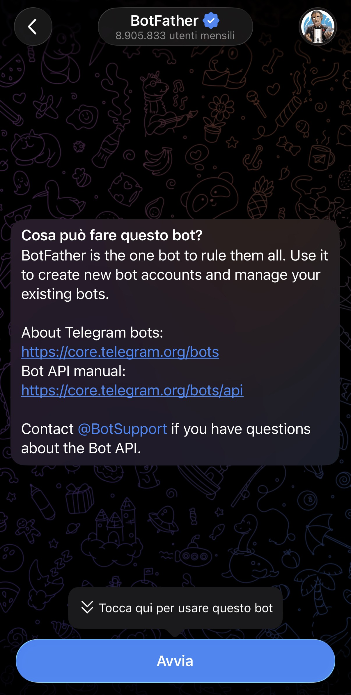

4. Send `/newbot`.

   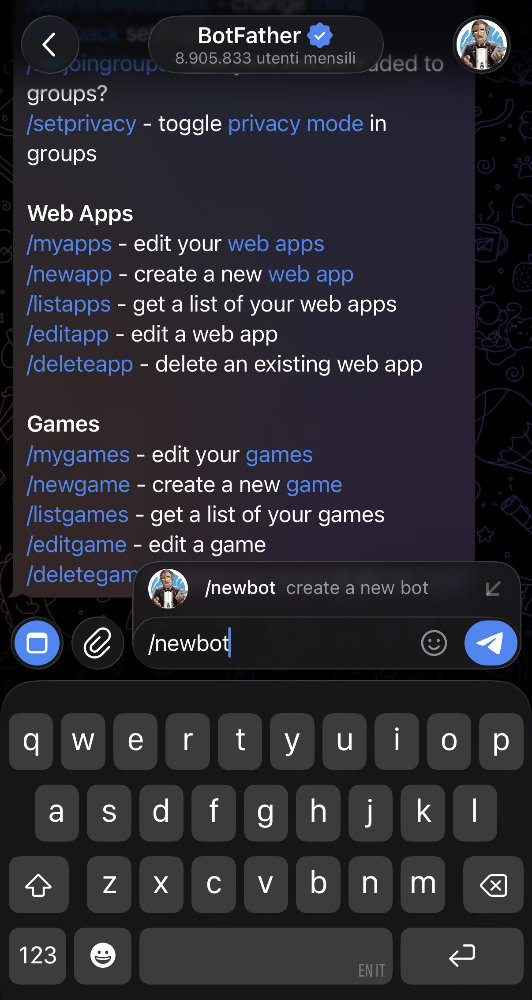

5. It asks for a name. Anything readable does: this is the name people see at
   the top of the chat, and you can change it later.

   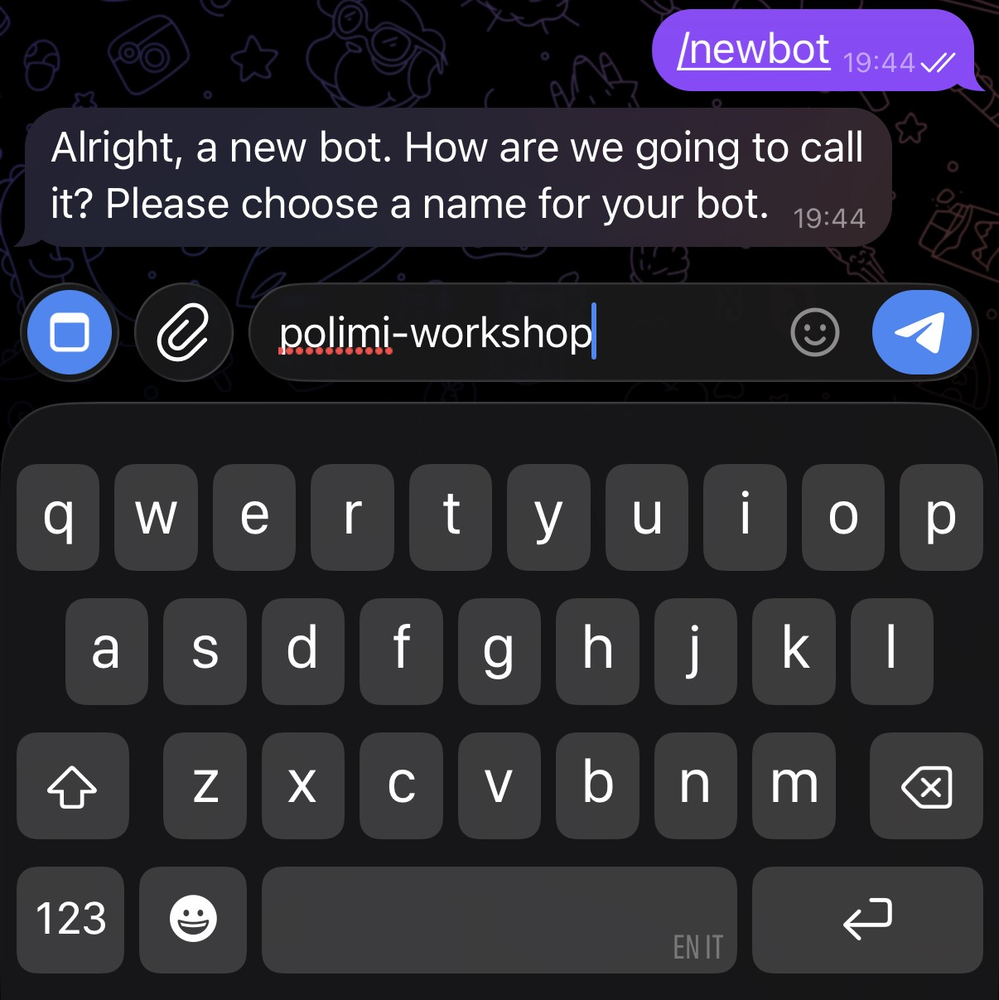

6. Then it asks for a username. This one has rules: it must end in `bot`, it
   may contain only letters, numbers and underscores — no hyphens, no
   spaces — and it must not be taken already. Expect to try two or three
   before one sticks; BotFather simply asks again each time.

   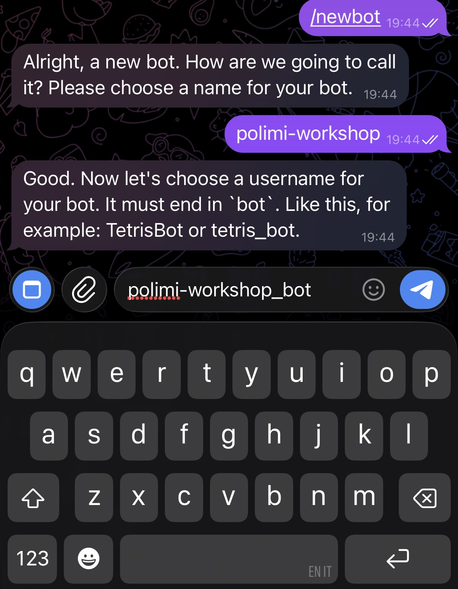

7. BotFather replies *Done!* and, under **Use this token to access the HTTP
   API**, your token. Tap it to copy it.

   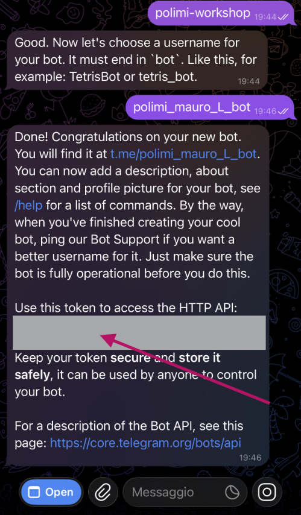

**That token is the value for `TELEGRAM_TOKEN`**, and for nothing else. The
other two Telegram lines in `.env` are filled in later, not by you and not
now:

- `TELEGRAM_WEBHOOK_SECRET_TOKEN` — a random string that
  `scripts/serve_bot.py` invents the first time you run it in session 2, and
  writes into `.env` itself.
- `TELEGRAM_ALLOWED_CHAT_IDS` — your own chat id, which you can only learn by
  messaging your bot once. Session 2 covers it.

Anyone holding the token can drive your bot, so treat it like a password: it
belongs in `.env`, which is git-ignored, and nowhere else.

## 4. Fill in your keys

There is already a `.env` waiting for you: find it in the file list down the
left side of the editor and click it to open.

Paste in the four values from steps [1](#1-get-a-google-ai-studio-key),
[2](#2-get-a-langfuse-account) and [3](#3-get-a-telegram-bot-token). One arrow
each, in the order you collected them:

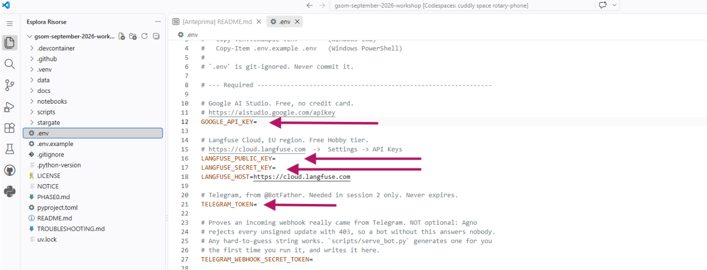

Each value goes immediately after the `=` on its own line, with no spaces
around it and no quotation marks — `GOOGLE_API_KEY=AIza...` and nothing else.
Then save the file: `Ctrl+S`, or `Cmd+S` on a Mac. Nothing works until it is
saved.

`.env` is git-ignored, so your keys never leave your machine — and never end up
in a commit.

The lines with no arrow stay as they are. `LANGFUSE_HOST` is already filled
in, and the two below it — `TELEGRAM_WEBHOOK_SECRET_TOKEN` and
`TELEGRAM_ALLOWED_CHAT_IDS` — stay empty until session 2 fills them in.

## 5. Run the check

```bash
uv run python scripts/check.py
```

This makes a real (tiny) call to Gemini and writes a real trace to Langfuse, so
anything broken breaks here, at home, the way it would break in session 1 —
rather than reporting that the files look fine. The embedding model it checks
for is already in the image, so there is nothing to download.

It prints something like:

```
READY  uv=0.9.2  python=3.12.8  marimo=ok  serve=ok  data=ok  gemini=ok
       langfuse=ok  fastembed=ok  telegram=ok  cloudflared=ok
```

## 6. Open a Phase 0 issue

The last thing `check.py` prints is a link that opens a new issue on this
repository with your `READY` line already in it. Click it and submit, at least
**three days before session 1**.

The line is only `label=value` pairs — no keys, no URLs, nothing private.

**Open it even if something says `MISSING` or `FAILED`.** That is what the
three days are for. Check [TROUBLESHOOTING.md](TROUBLESHOOTING.md) first, then
have a look at the other `phase-0` issues: if someone hit the same wall, the
answer is probably already sitting there.

## 7. Optional: open the first notebook once

Not required, but it removes the last surprise from the start of session 1.

```bash
uv run marimo edit --no-token
```

A box appears at the bottom right saying an application on port 2718 is
available: click **Open in Browser**. If you miss it or dismiss it, open the
**PORTS** tab — it sits next to TERMINAL, above the panel — find the row
labelled *marimo*, and click the globe icon in its Forwarded Address column.

You land on marimo's home page, listing every notebook in the repository. Click `notebooks/01_chat_completions.py`. You do not need to run
anything — just confirm it opens.

`--no-token` matters. Without it marimo demands an access key that exists only
in the URL printed in the terminal, and the tab that opens for you does not
carry it — so you get a login box instead of your notebooks. The flag costs
nothing here: port 2718 stays private, which is what protects it.

To stop: `Ctrl+C` in that terminal. The full workflow, including how to close
one notebook and open the next, is in
[*Running the notebooks*](README.md#running-the-notebooks) in README.md.

---

## Optional: OpenAI and Anthropic

Notebook 01 compares three providers. It ships with the outputs already saved,
so you can read the comparison without running it, and **you do not need these
keys**.

If you want to run it yourself, both require a payment method and a small
top-up (around €5 each). Add the keys to `.env` and everything else works
unchanged.

One caution: a key with billing attached is a different kind of thing from the
free ones above. The Google, Langfuse and Telegram credentials can at worst cost
you a quota; a card-backed key can cost you money. Add it when you want to run
notebook 01 yourself, and delete the line from `.env` again when you are done.
